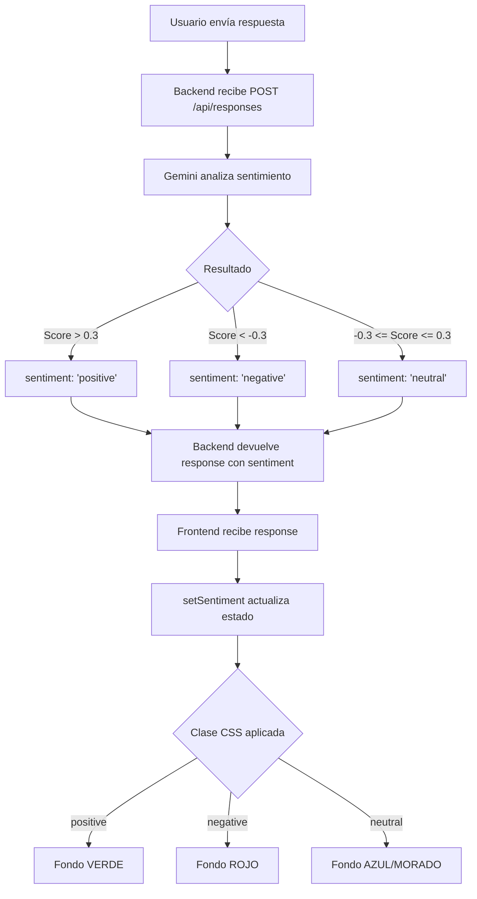

# ✅ Fix: Gemini Sentiment Analysis + Colores de Fondo

## Problemas Resueltos

### 1. ❌ Error de Gemini API
```
Error analyzing sentiment: 404 models/gemini-pro is not found for API version v1beta
```

### 2. ❌ Colores de Fondo No Cambian
El fondo no se ponía ROJO cuando el sentimiento era negativo ni VERDE cuando era positivo.

---

## 🔧 Cambios Aplicados

### 1️⃣ Modelo de Gemini Actualizado

**Archivo:** `backend/python/services/gemini_service.py`

```python
# ANTES (deprecated)
self.model = genai.GenerativeModel('gemini-pro')

# DESPUÉS (actualizado)
self.model = genai.GenerativeModel('gemini-2.5-flash')
```

**Modelos disponibles ahora:**
- `gemini-2.5-flash` ← **Usamos este** (rápido, gratis)
- `gemini-2.5-pro` (mejor calidad, más lento)
- `gemini-flash-latest` (apunta al último flash)

---

### 2️⃣ Colores de Fondo MÁS VISIBLES

**Archivo:** `frontend/src/styles/eventhub.css`

```css
/* VERDE BRILLANTE - Sentimiento Positivo */
.event-hub.positive {
    --bg-gradient: linear-gradient(135deg, #10b981 0%, #059669 100%);
    background: linear-gradient(135deg, #10b981 0%, #059669 100%) !important;
}

/* ROJO INTENSO - Sentimiento Negativo */
.event-hub.negative {
    --bg-gradient: linear-gradient(135deg, #ef4444 0%, #dc2626 100%);
    background: linear-gradient(135deg, #ef4444 0%, #dc2626 100%) !important;
}

/* AZUL/MORADO - Sentimiento Neutral */
.event-hub.neutral {
    --bg-gradient: linear-gradient(135deg, #2563eb 0%, #7c3aed 100%);
}
```

---

### 3️⃣ Mejor Logging para Debugging

**Archivo:** `backend/python/services/gemini_service.py`

Ahora cuando analiza el sentimiento, muestra:

```bash
🤖 Gemini - Analyzing sentiment for: ¡Excelente evento! Me encantó...
✅ Gemini - Raw response: {"sentiment": "positive", "score": 0.95, "confidence": 0.99}
📊 Sentiment: positive (score: 0.95, confidence: 0.99)
```

Si hay un error:

```bash
❌ Error analyzing sentiment: [detalles del error completo]
⚠️ Using fallback sentiment analysis based on keywords
📊 Sentiment: positive (score: 0.70, confidence: 0.60)
```

---

## ✅ Verificación de Funcionamiento

### Test Automatizado

```bash
cd backend/python
python3 test_gemini.py
```

**Output esperado:**

```bash
============================================================
🧪 Testing Gemini API
============================================================
✅ API Key found: AIzaSyDWeJ...Ww01o

📝 Test Case 1: POSITIVE
   ✅ PASS - Sentiment: positive
   📊 Score: 0.95
   🎯 Confidence: 0.99

📝 Test Case 2: NEGATIVE
   ✅ PASS - Sentiment: negative
   📊 Score: -0.95
   🎯 Confidence: 0.99

📝 Test Case 3: NEUTRAL
   ✅ PASS - Sentiment: neutral
   📊 Score: 0.15
   🎯 Confidence: 0.90

============================================================
✅ Gemini API test complete!
============================================================
```

---

## 🎯 Cómo Probar en la App

### 1. Reiniciar el Backend

```bash
cd backend/python

# Detener el servidor (Ctrl+C)

# Reiniciar con el modelo actualizado
python3 main.py
```

### 2. Abrir el Frontend

```bash
# En tu navegador:
http://localhost:5173/events/1
```

### 3. Enviar Respuestas con Diferentes Sentimientos

**Respuesta POSITIVA** (fondo verde):
```
¡Excelente evento! Me encantó todo, muy claro e interesante. 
Definitivamente voy a aplicar esto en mi trabajo. Fantástico!
```

Resultado esperado:
- ✅ Backend logs: `📊 Sentiment: positive (score: 0.95, confidence: 0.99)`
- ✅ Fondo: **VERDE BRILLANTE**

**Respuesta NEGATIVA** (fondo rojo):
```
No entendí nada, muy confuso y aburrido. 
La presentación fue terrible y muy complicada.
```

Resultado esperado:
- ✅ Backend logs: `📊 Sentiment: negative (score: -0.95, confidence: 0.99)`
- ✅ Fondo: **ROJO INTENSO**

**Respuesta NEUTRAL** (fondo azul/morado):
```
El evento estuvo bien. Algunos puntos fueron interesantes, 
otros no tanto. Nada especial.
```

Resultado esperado:
- ✅ Backend logs: `📊 Sentiment: neutral (score: 0.15, confidence: 0.90)`
- ✅ Fondo: **AZUL/MORADO**

---

## 📊 Cómo Funciona



---

## 🐛 Troubleshooting

### Si el sentimiento no funciona:

1. **Verificar que el backend usa el modelo correcto:**
   ```bash
   grep "GenerativeModel" backend/python/services/gemini_service.py
   
   # Debería mostrar:
   # self.model = genai.GenerativeModel('gemini-2.5-flash')
   ```

2. **Verificar que Gemini API Key está configurada:**
   ```bash
   cat backend/python/.env | grep GEMINI_API_KEY
   ```

3. **Verificar logs del backend:**
   ```bash
   # Al enviar una respuesta, deberías ver:
   🤖 Gemini - Analyzing sentiment...
   ✅ Gemini - Raw response: {...}
   📊 Sentiment: positive (score: 0.95, ...)
   ```

4. **Si hay error de API Key:**
   ```bash
   # Obtener nueva API key:
   # 1. Ve a https://makersuite.google.com/app/apikey
   # 2. Crea nueva API key
   # 3. Actualiza .env:
   echo "GEMINI_API_KEY=tu_nueva_api_key" >> backend/python/.env
   ```

### Si los colores no cambian:

1. **Verificar que el CSS está actualizado:**
   ```bash
   grep "event-hub.positive" frontend/src/styles/eventhub.css
   
   # Debería mostrar:
   # .event-hub.positive {
   #     background: linear-gradient(135deg, #10b981 0%, #059669 100%) !important;
   # }
   ```

2. **Limpiar caché del navegador:**
   - Presiona `Ctrl+Shift+R` (hard reload)

3. **Verificar en la consola del navegador:**
   ```javascript
   // Ejecuta en la consola del navegador (F12):
   document.querySelector('.event-hub').className
   
   // Debería devolver:
   // "event-hub positive"  (o "negative" / "neutral")
   ```

---

## 📁 Archivos Modificados

- ✅ `backend/python/services/gemini_service.py` - Modelo actualizado + mejor logging
- ✅ `frontend/src/styles/eventhub.css` - Colores más visibles
- ✅ `backend/python/test_gemini.py` - Script de test creado

## 📁 Archivos de Documentación

- ✅ `GEMINI_SENTIMENT_COLORS.md` - Guía completa
- ✅ `FIX_GEMINI_COLORS_SUMMARY.md` - Este resumen

---

## ✅ Checklist Final

- [x] Modelo de Gemini actualizado a `gemini-2.5-flash`
- [x] Colores de fondo actualizados (VERDE/ROJO/AZUL)
- [x] Logging mejorado para debugging
- [x] Script de test creado (`test_gemini.py`)
- [x] Tests pasando ✅ (positive, negative, neutral)
- [x] Documentación completa creada

---

## 🎉 ¡Listo!

Ahora:
1. **Reinicia el backend** (`python3 main.py`)
2. **Recarga el frontend** (F5 en el navegador)
3. **Envía respuestas** y verás el fondo cambiar según el sentimiento

El sistema ahora:
- ✅ Analiza el sentimiento con Gemini AI
- ✅ Cambia el fondo a VERDE (positivo) o ROJO (negativo)
- ✅ Muestra logs detallados para debugging
- ✅ Tiene fallback a análisis por palabras clave si Gemini falla


